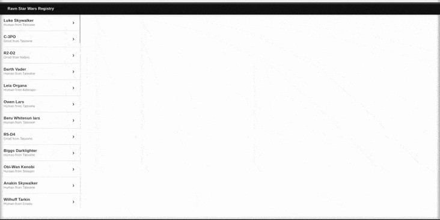

# RAVN GraphQL Code Challenge

## Project Description

This application allows you to view basic information about the characters of the famous Start Wars saga, the information is obtained from the APi Start Wars GraphQL or also called [SWAPI]("https://swapi-graphql.netlify.app/")

## Configuration / Execution

Install dependecies with

### `npm install`

Create a folder for production with

### `npm run build`

To run application on localhost, use

### `npm start`

## Application Operation

## Additional Information

To list all the characters that the API provides us, two things were considered:

- The first was to add a scroll bar to be able to view all the characters and thus respect the design provided.
  
- The second was to give the illusion of infinite scrolling, for this reason it was considered to show the paginated data based on cursors using the fetchMore function as indicated in the [ApolloCliente](https://www.apollographql.com/docs/react/data/pagination/) documentation.
  
## Technologies used

- **React**
- **Apollo Client**
- **GraphQL**
- **Sass**

## Deployment
You can find this application deployed here: https://ravncodechallengeswapi.web.app/ 
